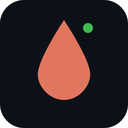
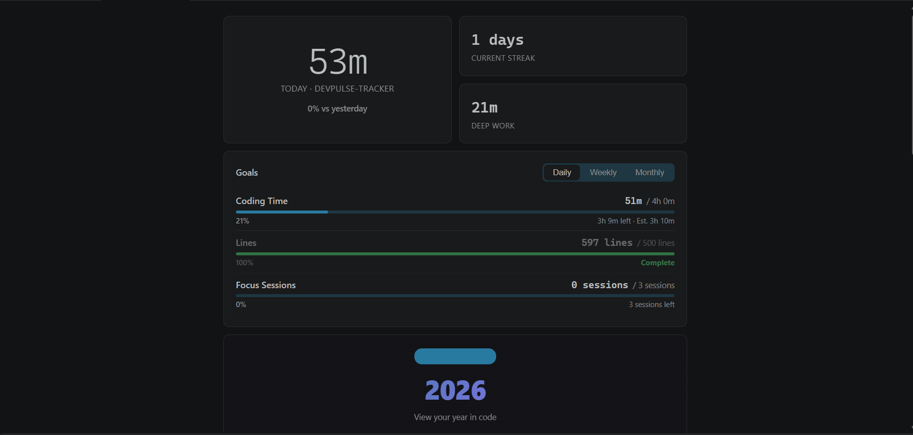
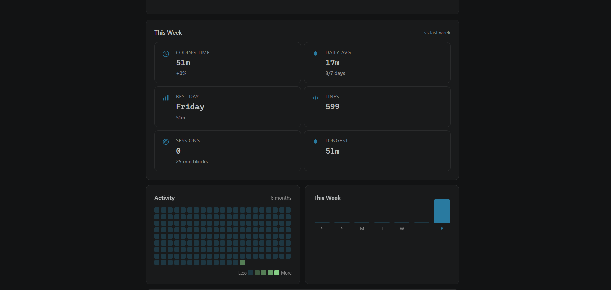
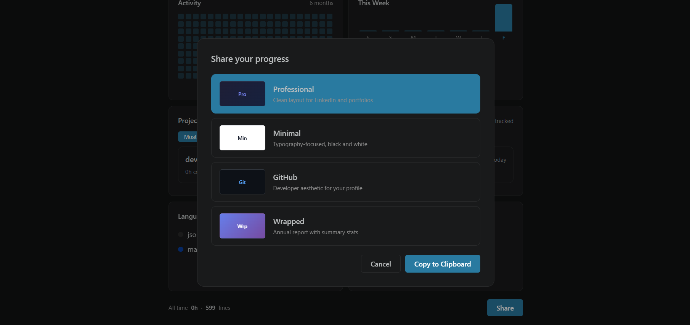

  

<h1 align="center">DevPulse</h1>

Local-first coding activity tracker for VS Code. Heatmaps, streaks, projects, and shareable summaries — all stored on your machine.

  
  

---

## How it works

Three screens. That's all you need to understand DevPulse.

  

**Your daily dashboard.** Active time, streak, goals, heatmap, and weekly trend — everything updates live as you code.

  

**Know where your time goes.** Weekly comparisons show trends. Project cards break down hours per workspace. Language stats reveal what you actually write.

  

**Share your progress.** Generate styled cards for LinkedIn or Twitter. Open your annual Wrapped for a full-screen review of your year in code.

---

## Privacy

- No cloud. No accounts. No telemetry.
- All data stored locally in a JSON file.
- Works offline. Export anytime.

---

## Install

Search **DevPulse** in VS Code (`Ctrl+Shift+X`) or install from the [Marketplace](https://marketplace.visualstudio.com/items?itemName=bistadev.devpulse-code).

---

## Commands

| Command | Description |
|---------|-------------|
| `DevPulse: Show Dashboard` | Open the main dashboard |
| `DevPulse: Open Yearly Wrapped` | View your annual report |
| `DevPulse: Copy Share Card` | Generate and copy a shareable card |
| `DevPulse: Export Data` | Export all tracking data as JSON |

---

## License

MIT