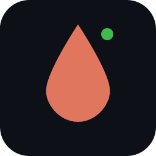
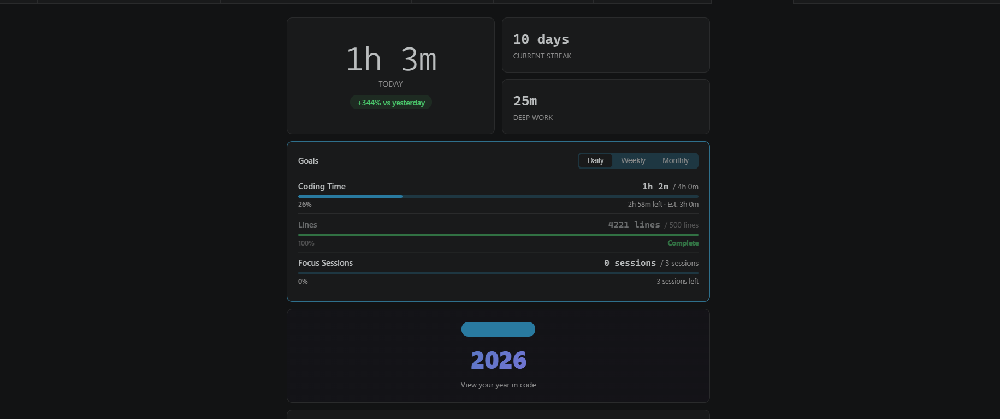
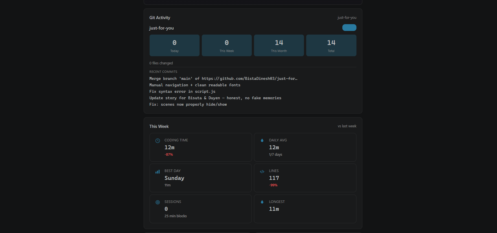
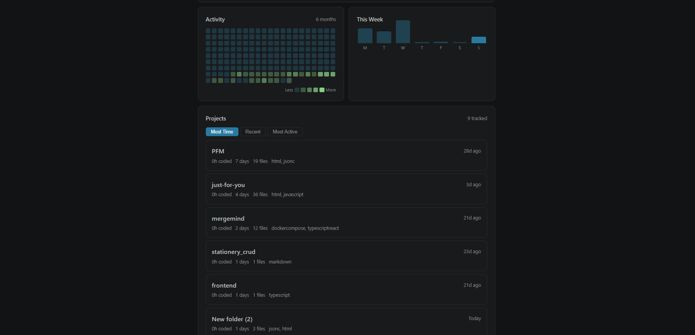
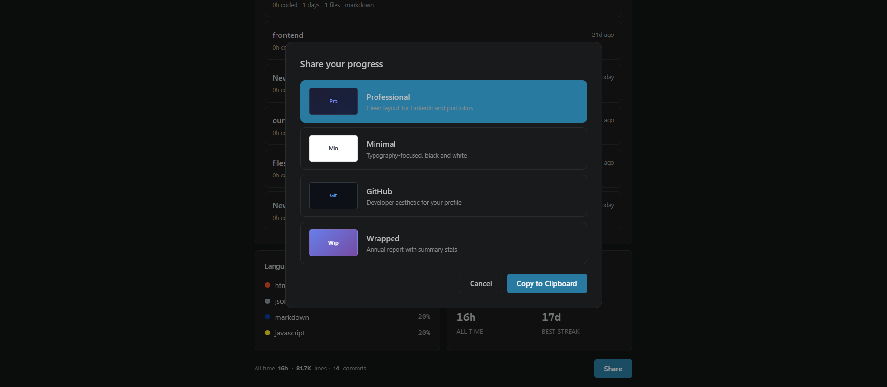

  

<h1 align="center">DevPulse</h1>

Local-first coding activity tracker for VS Code.

  
  

---

DevPulse is a local-first coding activity tracker for VS Code. It tracks your coding time, streaks, goals, projects, languages, Git activity, and weekly progress from a single dashboard. Your data stays on your machine.

---

## Dashboard

See today's coding time, current streak, deep work, and progress on your daily goals. The Year in Code banner gives quick access to your annual summary.

---

## Git and Weekly Analytics

View commits from today, this week, this month, and all time alongside weekly coding statistics. See total time, daily average, best day, lines, sessions, and longest session in one place.

---

## Coding Activity and Projects

The activity heatmap shows your coding consistency over time. Project cards break down hours, files, and languages per workspace, so you know where your time went.

---

## Languages and Overview

See your language breakdown with percentages and color bars. The overview panel summarizes lines today, saves, total coding time, and best streak.

---

## Share Your Progress

Create a styled summary of your coding activity. Choose from Professional, Minimal, GitHub, or Wrapped templates and copy the result to your clipboard.

---

## Features

- Coding time tracking
- Streaks and deep work
- Daily, weekly, and monthly goals
- Git activity and commit tracking
- Project tracking
- Language statistics
- Weekly analytics
- Activity heatmap
- Yearly and monthly Wrapped summaries
- Shareable progress cards
- Local-first data with export

---

## Privacy

- No account required
- Data stored locally
- No telemetry
- Works offline
- Export your data anytime

---

## Install

1. Open VS Code.
2. Open Extensions (`Ctrl+Shift+X`).
3. Search for `DevPulse`.
4. Install it.

Or install directly from the [VS Code Marketplace](https://marketplace.visualstudio.com/items?itemName=bistadev.devpulse-code).

---

## Commands

| Command | Description |
|---------|-------------|
| `DevPulse: Show Dashboard` | Open the main dashboard |
| `DevPulse: Open Yearly Wrapped` | View your annual report |
| `DevPulse: Open Monthly Wrapped` | View your monthly report |
| `DevPulse: Copy Share Card` | Generate and copy a shareable card |
| `DevPulse: Export Data` | Export all tracking data as JSON |

---

## Local Data

DevPulse stores your tracking data locally. Use the `DevPulse: Export Data` command to save a copy of your data.

---

## License

MIT